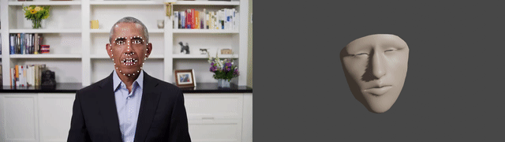

# MoFace

This is a Face Motion Blender animation addon.



The main idea of keypoints usage is from [blender-addon-openpose](https://gitlab.com/sat-metalab/blender-addon-openpose) repository. Code from this this repository you can see in the [openpose](./openpose) folder.

## Installation

This addon can be installed in two ways:

* Zip the [moface](./moface) folder. And install the zipfile like any other Blender addon.
* Copy [moface](./moface) folder or make a symlink to the addon directory (for example `~/blender-2.83.4-linux64/2.83/scripts/addons/` or `/Applications/Blender.app/Contents/Resources/2.81/scripts/addons/`).

## Addon usage

### Prepare a keypoints file

An example of keypooints .tsv file you can see in the [assets](./assets) folder.

#### 1. Extract frames from a video file using ffmpeg

For example:

```
ffmpeg -i ../data/moface/video.mp4 ../data/moface/frames/frame%05d.png
```

#### 2. Make keypooints files for each frame

Example of keypoints extracting you can see in the [run_openpose.py](run_openpose.py) script. For more information about keypoints you can see in the [OpenPose Project](https://github.com/CMU-Perceptual-Computing-Lab/openpose) documentation.

```
python3 run_openpose.py
```

#### 3. Combine keypoints in one .tsv file

See the [preprocess_keypoints.py](preprocess_keypoints.py) script.

```
python3 preprocess_keypoints.py
```

### Start animation from a keypoints file


